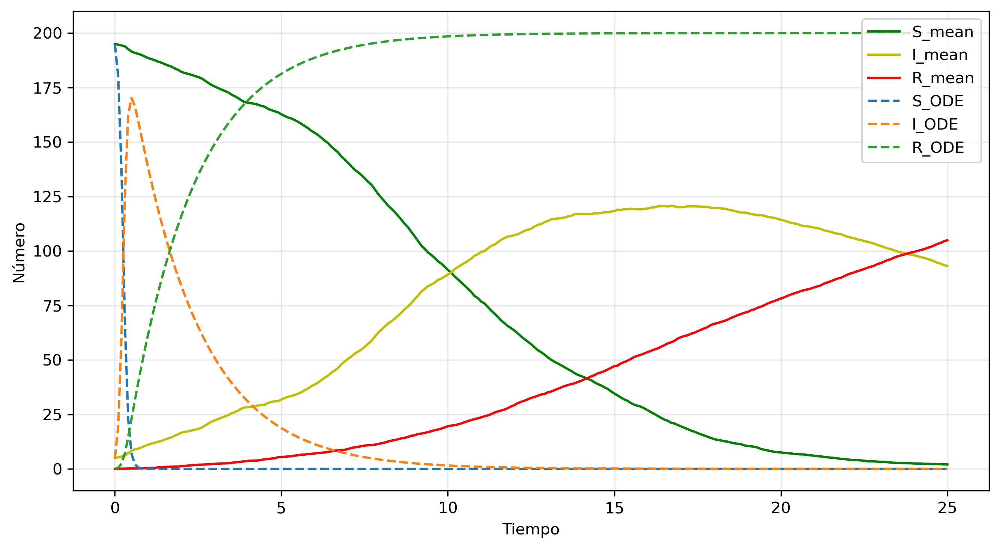
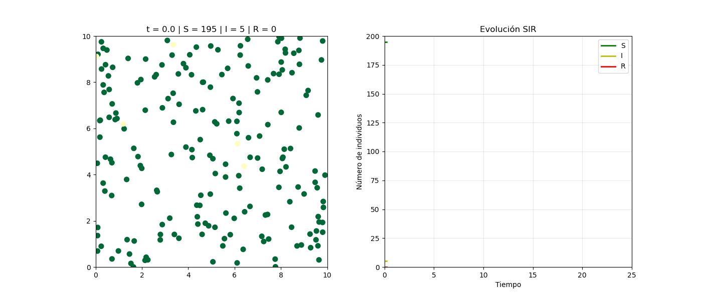
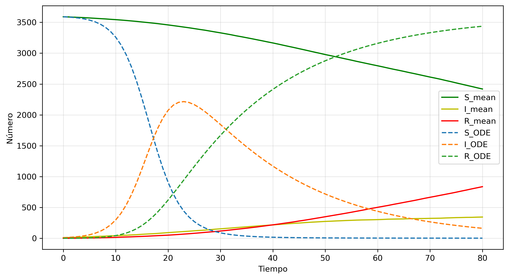
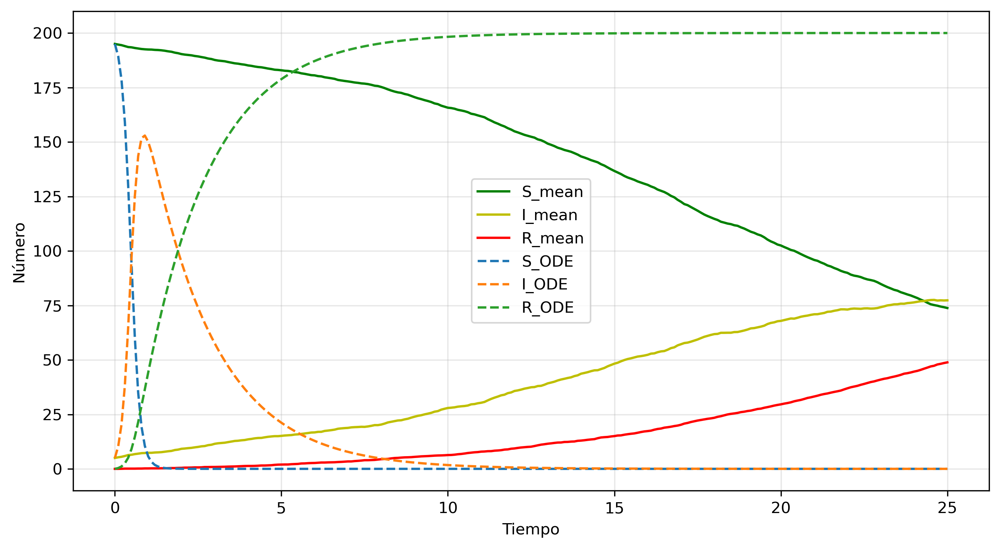
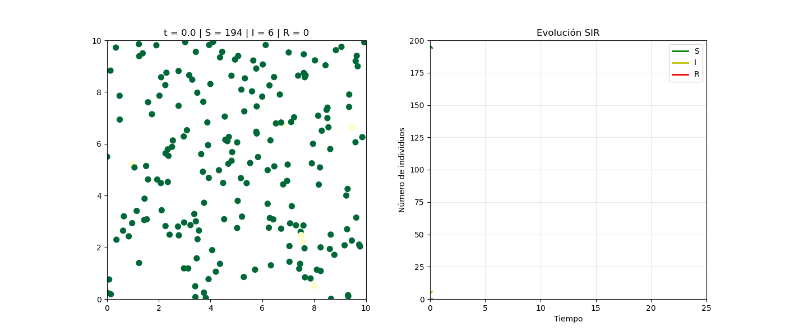
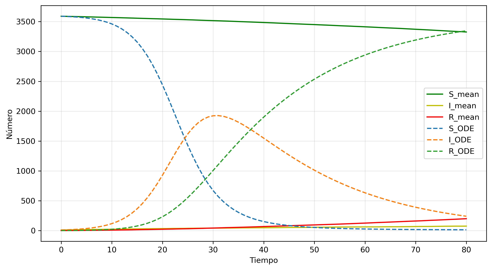
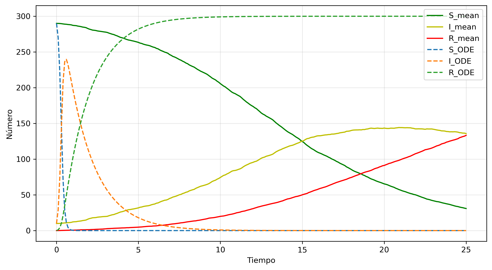
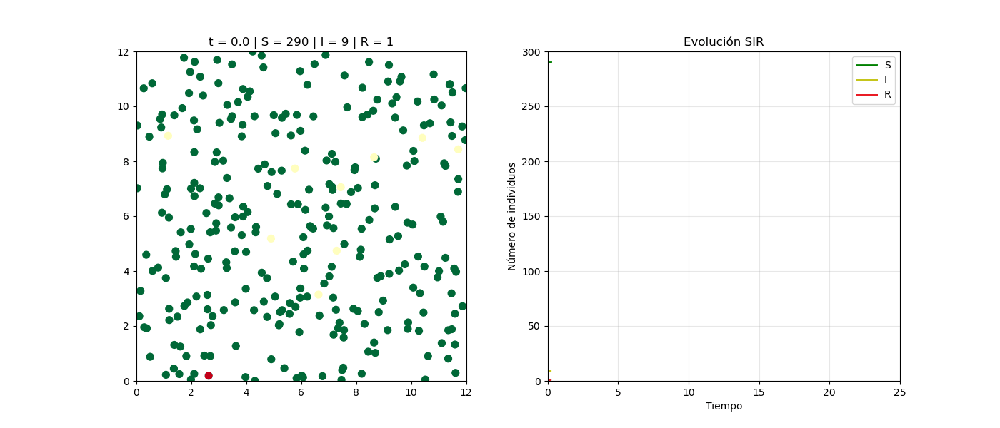
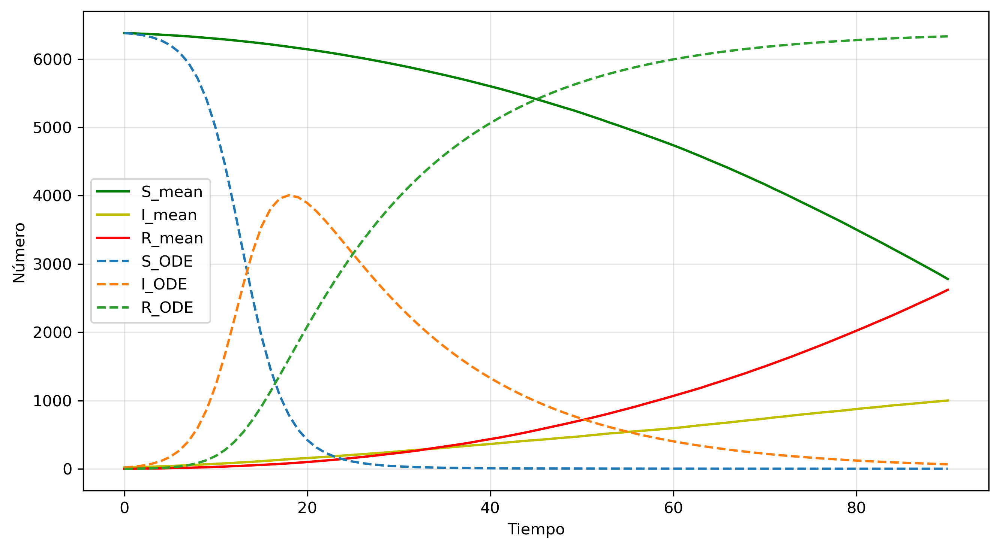
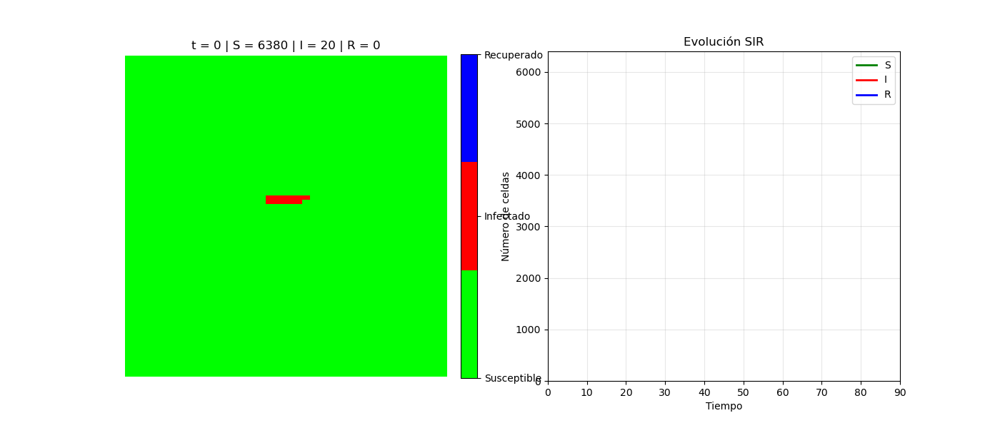

# Resultados de Simulación de Modelos SIR

---

Para las animaciones es recomendable visualizar desde el repositorio, el archivo `resultados.md`

---

## Set 1

**Parámetros (Partículas)**
`{'L': 10.0, 'N': 200, 'I0': 5, 'vmax': 0.8, 'r': 0.3, 'beta': 1.5, 'gamma': 0.05, 'dt': 0.1, 'steps': 250}`

### Promedios del Modelo de Partículas

Este gráfico de líneas muestra la evolución temporal de las poblaciones promedio de Susceptibles (S), Infectados (I) y Recuperados (R) para el modelo de partículas. Compara los resultados de la simulación con el modelo teórico ODE, mostrando un pico de infectados en la simulación más tardío y bajo que el predicho por el ODE

### Simulación SIR con Partículas

Esta animación visualiza el comportamiento dinámico de la simulación de partículas. El panel izquierdo muestra las 200 partículas moviéndose en el espacio y cambiando de estado, mientras que el gráfico de la derecha muestra el conteo total de S, I y R en tiempo real a medida que la epidemia progresa.

**Parámetros (Autómata Celular)**
`{'M': 60, 'N': 60, 'I0': 10, 'r': 2, 'beta': 0.4, 'gamma': 0.05, 'T': 80, 'start_point': (15, 15)}`

### Promedios del Autómata Celular

Este gráfico de líneas presenta los promedios de S, I y R a lo largo del tiempo para el modelo de autómata celular. Al igual que el gráfico de partículas, compara los promedios de la simulación con el modelo ODE, evidenciando que la simulación en la cuadrícula produce un pico de infección mucho más bajo y retrasado (cerca de t=25) que el modelo teórico

### Simulación SIR con Autómata Celular

Se puede observar cómo la infección se propaga espacialmente desde un punto de inicio a través de la población susceptible, que luego se convierte en recuperada, mientras los gráficos de la derecha rastrean los conteos totales.

---

## Set 2

**Parámetros (Partículas)**
`{'L': 10.0, 'N': 200, 'I0': 5, 'vmax': 0.4, 'r': 0.3, 'beta': 0.8, 'gamma': 0.05, 'dt': 0.1, 'steps': 250}`

### Promedios del Modelo de Partículas

Este gráfico de líneas corresponde a los promedios del Set 2 de partículas. Con parámetros diferentes, se observa una curva de infectados mucho más plana y un pico casi inexistente, indicando una propagación muy lenta, lo cual difiere significativamente del pico agudo predicho por el modelo ODE.

### Simulación SIR con Partículas

La animación permite observar la interacción de las 200 partículas bajo los nuevos parámetros, donde la enfermedad se propaga de manera mucho más lenta y menos explosiva, como se refleja en el gráfico de evolución SIR de la derecha

**Parámetros (Autómata Celular)**
`{'M': 60, 'N': 60, 'I0': 10, 'r': 1, 'beta': 0.3, 'gamma': 0.05, 'T': 80, 'start_point': None}`

### Promedios del Autómata Celular

Este gráfico de líneas muestra los resultados promedio del autómata celular del Set 2. Los parámetros modificados (menor radio r y beta ) resultan en una propagación de la enfermedad extremadamente lenta; la curva de infectados (I_mean) permanece muy baja y plana durante toda la simulación, en marcado contraste con el modelo ODE.

### Simulación SIR con Autómata Celular

Esta animación presenta la simulación del autómata celular del Set 2. Al no tener un punto de inicio fijo y un radio de infección más pequeño , se puede visualizar la dificultad de la enfermedad para propagarse por la cuadrícula de 60x60, resultando en una epidemia muy contenida.

---

## Set 3

**Parámetros (Partículas)**
`{'L': 12.0, 'N': 300, 'I0': 10, 'vmax': 0.8, 'r': 0.25, 'beta': 1.2, 'gamma': 0.06, 'dt': 0.1, 'steps': 250}`

### Promedios del Modelo de Partículas

Este gráfico de líneas muestra los promedios S, I y R para el Set 3 de partículas, que utiliza una población mayor, N=300. Similar al Set 1, la simulaciónmuestra un pico de infectados más bajo y tardío que el modelo ODE, aunque la epidemia logra propagarse significativamente entre la población.

### Simulación SIR con Partículas

Esta animación visualiza la simulación de 300 partículas en un espacio más grande. Permite observar la dinámica espacial de la epidemia bajo estos parámetros, mostrando la interacción entre un mayor número de individuos y su impacto en la curva de evolución SIR trazada en el gráfico derecho.

**Parámetros (Autómata Celular)**
`{'M': 80, 'N': 80, 'I0': 20, 'r': 2, 'beta': 0.5, 'gamma': 0.06, 'T': 90, 'start_point': (40, 40)}`

### Promedios del Autómata Celular

Este gráfico de líneas presenta los promedios para el autómata celular del Set 3, ahora en una cuadrícula más grande de 80x80. Muestra una clara discrepancia con el modelo ODE: la simulación tiene un pico de infecciones retrasado (cerca de t=50) y más bajo, en comparación con el pico agudo y temprano (t=20) del modelo ODE.

### Simulación SIR con Autómata Celular

Este gráfico de líneas presenta los promedios para el autómata celular del Set 3, ahora en una cuadrícula más grande de 80x80. Muestra una clara discrepancia con el modelo ODE: la simulación tiene un pico de infecciones retrasado (cerca de t=50) y más bajo, en comparación con el pico agudo y temprano (t=20) del modelo ODE.

---

[Link al repositorio](https://github.com/donmatthiuz/ModelacionSimu/tree/lab6)
